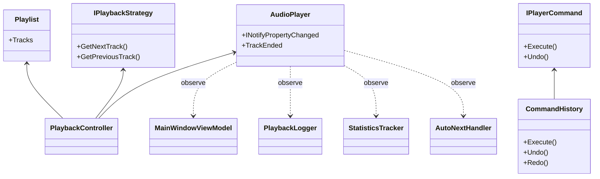
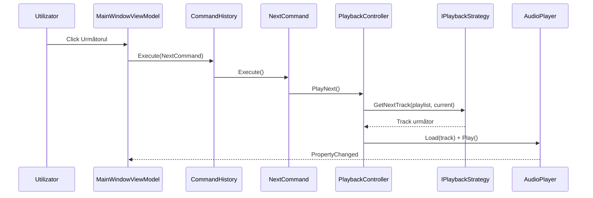

# MusicPlayer — Laborator 8 (MAP)

Player desktop WPF cu **Observer**, **Strategy** și **Command**, redare audio reală prin **NAudio**.

## Cerințe îndeplinite

| Pattern | Implementare |
|---------|----------------|
| Observer | `AudioPlayer` (`INotifyPropertyChanged`, `TrackEnded`), `Playlist` (`ObservableCollection`), observatori: `MainWindowViewModel`, `PlaybackLogger`, `StatisticsTracker`, `AutoNextHandler` |
| Command | `IPlayerCommand`, comenzi play/pause/next/previous + modificări playlist, `CommandHistory` (undo/redo, max 50) |
| Strategy | `IPlaybackStrategy` — Secvențial, Aleator, Smart Shuffle, Repetă unul |

## Rulare

```bash
dotnet build MusicPlayer.sln
dotnet test MusicPlayer.sln
dotnet run --project src/MusicPlayer/MusicPlayer.csproj
```

În aplicație: **+ Adaugă fișiere…** → selectează MP3/WAV din `samples/` sau de pe disc.

## Structură

```
MusicPlayer.sln
├── src/MusicPlayer/     (WPF + MVVM)
└── tests/MusicPlayer.Tests/
```

## Diagramă clase (pattern-uri)



## Secvență: Skip → Strategy → Player



## Capturi ecran

După rulare, fă capturi pentru:

1. Panoul **Acum se redă** cu o piesă încărcată
2. **Mod redare** cu altă strategie selectată
3. Panoul **Istoric** după câteva acțiuni undoable

Salvează imaginile în `docs/screenshots/` (opțional).

## Note

- Log redare: `playback_log.txt` lângă executabil
- `.NET 7` (SDK instalat); cod compatibil cu stil C# modern
- Fișierele audio nu sunt incluse în repo — vezi `samples/README.txt`
