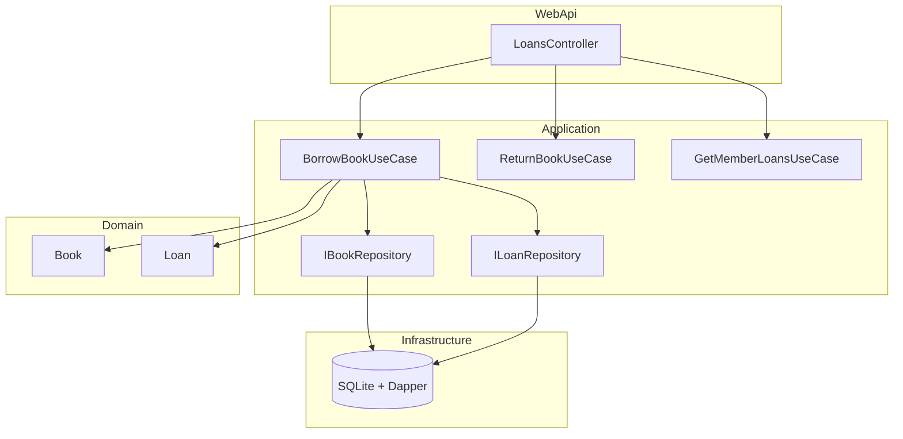

# Library - Laborator 10 (MAP)

Sistem de biblioteca implementat cu **Clean Architecture**: Domain, Application, Infrastructure, WebApi.

## Cerinte indeplinite

| Strat | Rol |
|-------|-----|
| Domain | Entitati cu reguli: `Book`, `Loan`, `Member` |
| Application | Use cases + contracte repository (`IBookRepository`, `ILoanRepository`) |
| Infrastructure | Implementari Dapper + SQLite |
| WebApi | Controller HTTP + composition root |

## Reguli business

- Cartea se imprumuta doar daca `AvailableCopies > 0`
- Membru: maxim 5 imprumuturi active
- Returnare intarziata: penalizare 2 RON / zi dupa `DueDate`

## Use cases

- `BorrowBookUseCase` - imprumuta carte
- `ReturnBookUseCase` - returneaza + calculeaza penalizare
- `GetMemberLoansUseCase` - lista imprumuturi active

## Rulare

```bash
dotnet build Library.sln
dotnet test Library.sln
dotnet run --project src/Library.WebApi/Library.WebApi.csproj
```

- **Swagger**: http://localhost:5000/swagger
- **DB**: `library.db` (SQLite, seed automat)

Teste HTTP: `src/Library.WebApi/docs/requests.http`

## Structura

```
Library.sln
├── src/
│   ├── Library.Domain/
│   ├── Library.Application/
│   │   ├── Abstractions/
│   │   └── UseCases/
│   ├── Library.Infrastructure/
│   │   └── Persistence/
│   └── Library.WebApi/
└── tests/
    └── Library.Application.Tests/
```

## Dependinte intre proiecte

```
WebApi -> Application, Infrastructure
Infrastructure -> Application
Application -> Domain
```

WebApi refera doar Application in Controllers; Infrastructure este legat in `Program.cs`.

## Diagrama



## Seed implicit

| Entitate | Id | Detalii |
|--------|-----|---------|
| Member | `aaaaaaaa-aaaa-aaaa-aaaa-aaaaaaaaaaaa` | Ana Pop |
| Book | `bbbbbbbb-bbbb-bbbb-bbbb-bbbbbbbbbbbb` | Clean Code, 3 exemplare |
