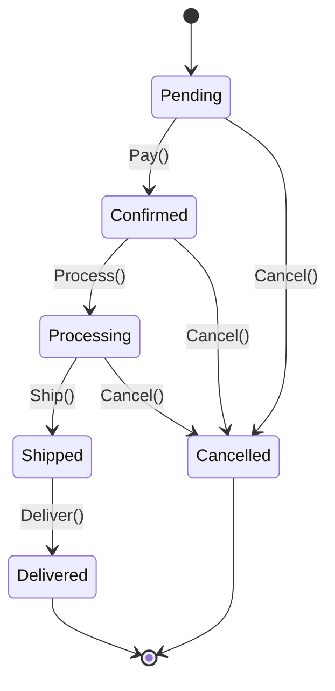
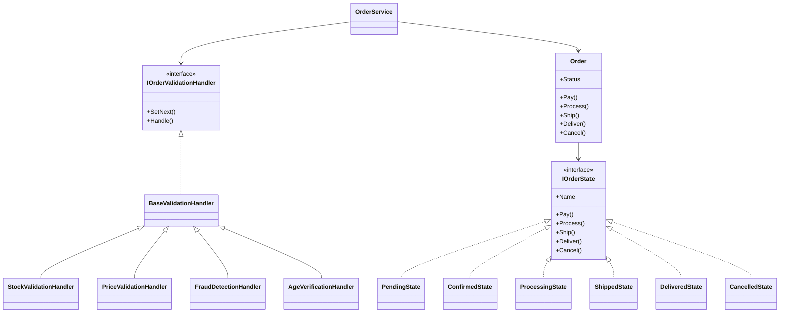
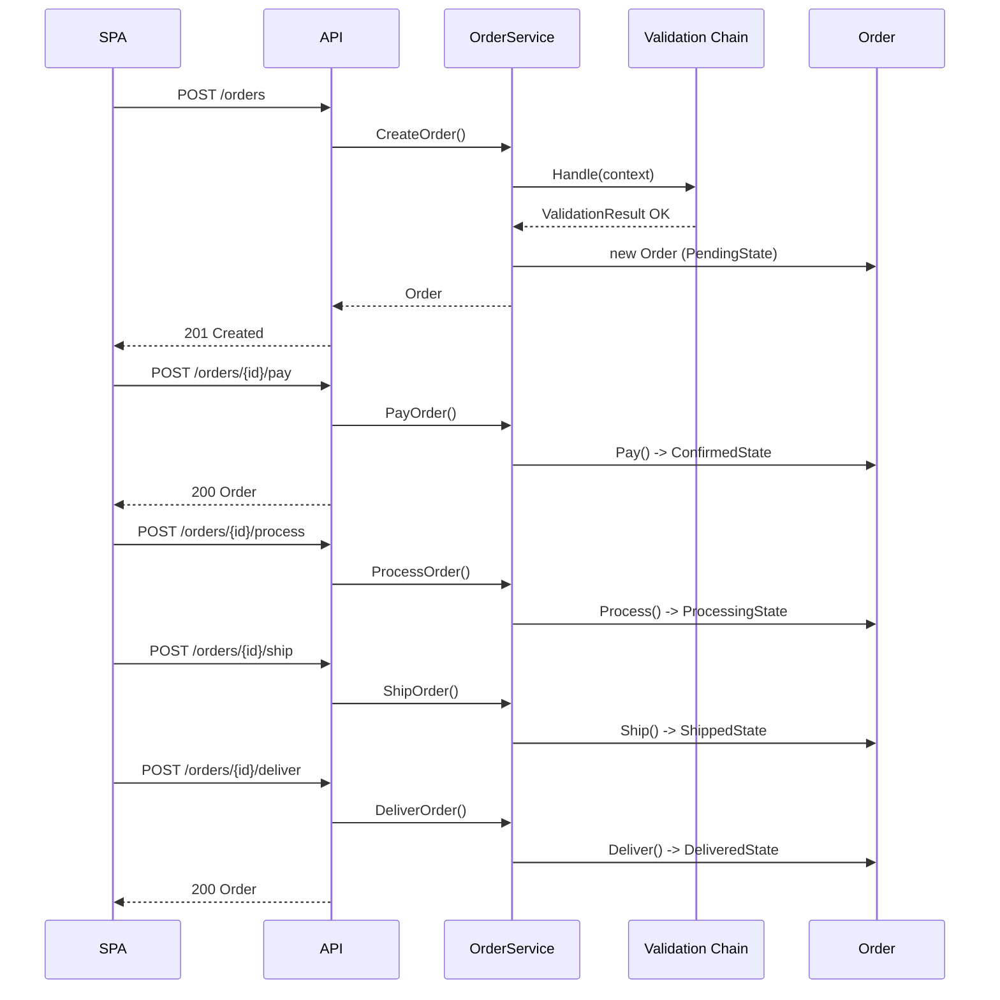

# OrderProcessing - Laborator 9 (MAP)

Sistem de procesare comenzi cu **Chain of Responsibility** (validare la creare) si **State** (ciclul de viata al comenzii). Backend ASP.NET Core Minimal API + SPA vanilla JavaScript.

## Cerinte indeplinite


| Pattern                 | Implementare                                                                            |
| ----------------------- | --------------------------------------------------------------------------------------- |
| Chain of Responsibility | `IOrderValidationHandler` + 4 handler-i (Stock -> Price -> Fraud -> Age), short-circuit |
| State                   | `IOrderState` + 6 stari, tranzitii decentralizate, `InvalidOrderTransitionException`    |


## Rulare

```bash
dotnet build OrderProcessing.sln
dotnet run --project src/OrderProcessing.Api/OrderProcessing.Api.csproj
```

- **SPA**: [http://localhost:5000](http://localhost:5000)
- **Swagger**: [http://localhost:5000/swagger](http://localhost:5000/swagger)

Teste HTTP: `src/OrderProcessing.Api/docs/requests.http`

## Structura

```
OrderProcessing.sln
└── src/OrderProcessing.Api/
    ├── Domain/          - Order, Customer, value objects
    ├── States/          - State Pattern (6 stari)
    ├── Validation/      - Chain of Responsibility
    ├── Services/        - OrderService, repository in-memory
    ├── Endpoints/       - Minimal API
    ├── wwwroot/         - SPA (index.html, styles.css, app.js)
    └── docs/            - requests.http, screenshots/
```

## Order Lifecycle




## Diagrama de clase




## Secventa: creare + livrare




## Screenshot-uri

Adauga capturi in `src/OrderProcessing.Api/docs/screenshots/`:

1. Comanda nou creata (Pending, Pay + Cancel active)
2. Comanda Shipped (doar Deliver enabled)
3. Eroare tranzitie invalida (toast rosu, 409)
4. Validare esuata la creare (stoc / varsta)

## Endpoint-uri


| Metoda | Ruta                   | Descriere                        |
| ------ | ---------------------- | -------------------------------- |
| POST   | `/orders`              | Creeaza comanda (chain validare) |
| GET    | `/orders`              | Lista comenzi                    |
| GET    | `/orders/{id}`         | Detalii + history                |
| POST   | `/orders/{id}/pay`     | Pending -> Confirmed             |
| POST   | `/orders/{id}/process` | Confirmed -> Processing          |
| POST   | `/orders/{id}/ship`    | Processing -> Shipped            |
| POST   | `/orders/{id}/deliver` | Shipped -> Delivered             |
| POST   | `/orders/{id}/cancel`  | -> Cancelled (daca permis)       |


