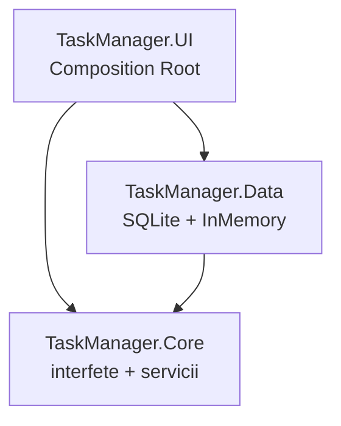

# Task Manager — Laborator 3 + 4 (SOLID, ISP, DIP)

Aplicatie .NET de gestiune a sarcinilor: SQLite, WinForms, principii SOLID, ISP si container IoC.

## Rulare

```bash
dotnet restore
dotnet test
dotnet run --project src/TaskManager.UI/TaskManager.UI.csproj
```

Pachete: `Microsoft.Data.Sqlite` (Data), `Microsoft.Extensions.DependencyInjection` (UI), NUnit (Tests).

## Structura proiect



- **UI** depinde de **Core** si **Data** (asamblarea DI in `Program.cs`).
- **Data** depinde doar de **Core**.
- **Core** nu depinde de UI sau Data si nu refera `Microsoft.Data.Sqlite`.

## ISP — ReportService si ITaskReader / ITaskWriter

`ITaskRepository` a fost segregata:

- `ITaskReader` — `GetAll()`, `GetById()`
- `ITaskWriter` — `Add()`, `Update()`, `Delete()`
- `ITaskRepository : ITaskReader, ITaskWriter`

`SqliteTaskRepository` si `InMemoryTaskRepository` implementeaza in continuare `ITaskRepository` fara modificari de cod.

`ReportService` primeste **doar** `ITaskReader` — are nevoie doar sa citeasca sarcini pentru `GenerateSummary()`. Nu trebuie sa primeasca `ITaskRepository` pentru ca:

- nu ar folosi niciodata `Add` / `Update` / `Delete`;
- compilatorul ar permite apeluri accidentale de scriere daca tipul ar fi repository complet;
- testele folosesc un mock sau `InMemoryTaskRepository` cast la `ITaskReader`, fara obligatia de a implementa metode de scriere in mock-uri de raport.

## DIP — Composition Root

Toate dependentele sunt inregistrate in `Program.cs` (`ServiceCollection`):

| Serviciu | Implementare | Lifetime |
|----------|--------------|----------|
| `SqliteTaskRepository` | concret | Singleton |
| `ITaskRepository` | acelasi singleton SQLite | Singleton |
| `ITaskReader` | acelasi singleton SQLite | Singleton |
| `TaskValidator` | concret | Transient |
| `TaskService` | concret | Transient |
| `ReportService` | concret | Transient |
| notificatori | `AddTaskManagerNotifiers()` | Singleton |

`MainForm` primeste `TaskService` si `ReportService` prin constructor — fara `new` pentru servicii de business.

## Decizii de design SOLID

| Principiu | Unde se aplica | Problema rezolvata |
|-----------|----------------|-------------------|
| **SRP** | `TaskValidator`, `TaskService`, `ReportService`, notificatori separati | Fiecare clasa are un singur motiv de schimbare |
| **OCP** | `ITaskNotifier` + dictionar in `TaskService`; `SlackNotifier` adaugat fara modificarea serviciului | Extindere notificari fara editarea logicii existente |
| **LSP** | `TaskItem` / `RecurringTask` / `DeadlineTask` — `Complete()`; repository-uri interschimbabile | Subtipuri respecta contractul si pot inlocui baza |
| **ISP** | `ITaskReader` / `ITaskWriter`; `ReportService(ITaskReader)` | Clientii nu depind de metode pe care nu le folosesc |
| **DIP** | Interfete in Core; implementari in Data; DI in UI | Business logic nu depinde de SQLite sau WinForms |

## Teste

`dotnet test` — teste Laborator 3 (ierarhie, validator, service) + Laborator 4 (`ReportServiceTests`, `DependencyInjectionTests` — ISP, DIP, notificatori parametrizati).
