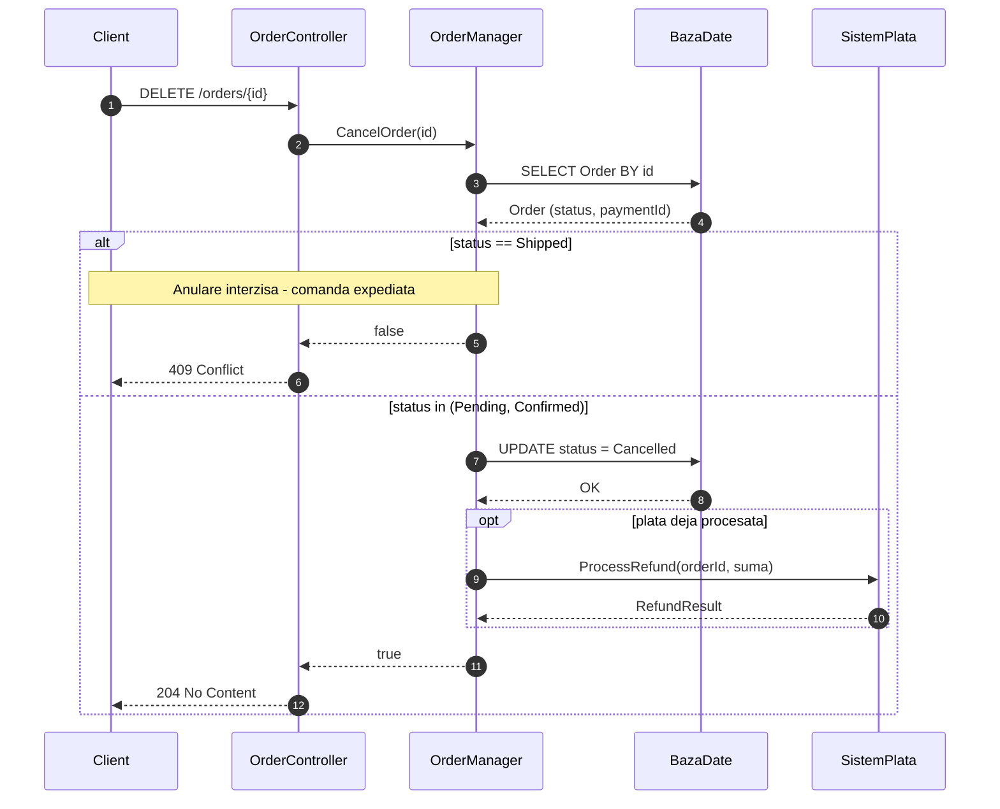

# Flux 2 — Anularea unei comenzi

```mermaid
sequenceDiagram
    autonumber
    participant C as Client
    participant OC as OrderController
    participant OM as OrderManager
    participant DB as BazaDate
    participant PG as SistemPlata

    C->>OC: DELETE /orders/{id}
    OC->>OM: CancelOrder(id)

    OM->>DB: SELECT Order BY id
    DB-->>OM: Order (status, paymentId)

    alt status == Shipped
        Note over OM,C: Anulare interzisa - comanda expediata
        OM-->>OC: false
        OC-->>C: 409 Conflict
    else status in (Pending, Confirmed)
        OM->>DB: UPDATE status = Cancelled
        DB-->>OM: OK

        opt plata deja procesata
            OM->>PG: ProcessRefund(orderId, suma)
            PG-->>OM: RefundResult
        end

        OM-->>OC: true
        OC-->>C: 204 No Content
    end
```
