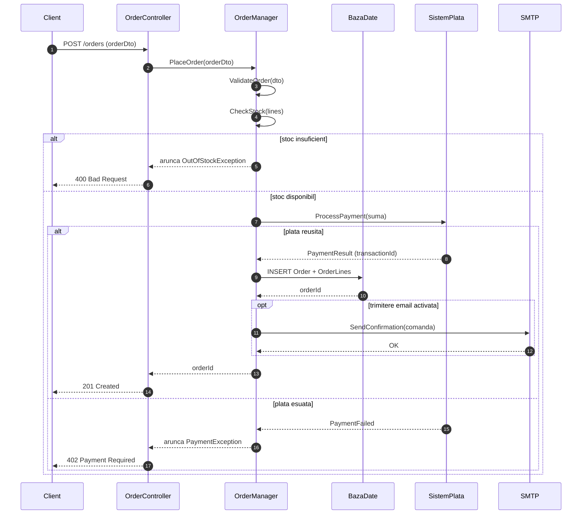

# Flux 1 — Plasarea unei comenzi

```mermaid
sequenceDiagram
    autonumber
    participant C as Client
    participant OC as OrderController
    participant OM as OrderManager
    participant DB as BazaDate
    participant PG as SistemPlata
    participant Mail as SMTP

    C->>OC: POST /orders (orderDto)
    OC->>OM: PlaceOrder(orderDto)

    OM->>OM: ValidateOrder(dto)
    OM->>OM: CheckStock(lines)

    alt stoc insuficient
        OM-->>OC: arunca OutOfStockException
        OC-->>C: 400 Bad Request
    else stoc disponibil
        OM->>PG: ProcessPayment(suma)

        alt plata reusita
            PG-->>OM: PaymentResult (transactionId)
            OM->>DB: INSERT Order + OrderLines
            DB-->>OM: orderId

            opt trimitere email activata
                OM->>Mail: SendConfirmation(comanda)
                Mail-->>OM: OK
            end

            OM-->>OC: orderId
            OC-->>C: 201 Created
        else plata esuata
            PG-->>OM: PaymentFailed
            OM-->>OC: arunca PaymentException
            OC-->>C: 402 Payment Required
        end
    end
```
